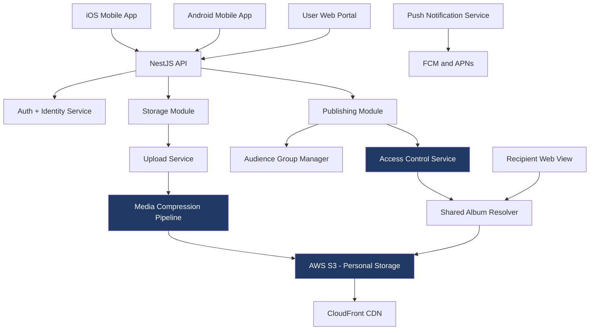

# Personalized OTT + Personal Storage Platform

> A dual-module mobile-first platform combining personal media storage on AWS S3 with a controlled-access publishing layer — letting users back up their own photos and videos, then selectively share them with specific individuals or family groups.

---

## Context

Most personal media platforms force a binary choice: either everything is private (like a photo backup app) or everything is public (like Instagram). Real users want neither extreme. They want to back up their wedding photos, then share them with extended family — but not their college friends. They want their kids' videos preserved forever, but visible only to grandparents living abroad.

Our client's vision was a platform that solved this in one app: storage for the user, controlled-access publishing for selected audiences. Two modules, one platform, both on iOS and Android.

---

## My Role

**Director & Chief Technology Officer** — Vriksha Techno Solutions Pvt. Ltd.

- Owned the AWS S3 architecture decision over alternatives (Firebase, GCS, Azure Blob)
- Designed the dual-module separation — personal storage vs. publishing layer
- Specified the access control model that lets users define audience groups (immediate family, extended family, friends-only, etc.)
- Made the iOS-vs-Android-vs-cross-platform call (we chose native iOS + native Android for performance)
- Led the engineering team through media compression, upload reliability, and offline-first decisions

---

## Architecture (high level)

---

## Tech Stack

- **Backend:** NestJS, TypeScript, Node.js
- **Database:** MySQL (user accounts, audience groups, share metadata)
- **Storage:** AWS S3 (primary media storage), CloudFront CDN (delivery to recipients)
- **Mobile:** Native iOS (Swift), Native Android (Kotlin)
- **Notifications:** Firebase Cloud Messaging (Android) + Apple Push Notification (iOS)
- **Infrastructure:** AWS EC2 application tier, RDS, S3 lifecycle policies for cost management

---

## Key Technical Decisions

**Native iOS and Android, not cross-platform.**
This was a hard decision. Cross-platform (Flutter or React Native) would have been faster to build and maintain. But for a media-heavy app where camera integration, photo library access, video playback, and offline upload reliability all needed to work flawlessly, native gave us platform-specific control we'd lose with abstraction layers. Each module shipped 2x faster on its respective platform once the native foundation was solid.

**S3 as source of truth, with strict lifecycle policies.**
Personal media platforms accumulate data at frightening rates. Without lifecycle management, a single user's storage costs grow indefinitely. We implemented S3 Intelligent-Tiering for older content (auto-moves to lower-cost tiers based on access patterns), giving users the impression of "infinite storage" while keeping AWS bills manageable for the client.

**Two modules with shared identity, separate UX.**
We could have built one app that does both storage and publishing. We chose two distinct modules in one app (toggle between them) because the user mental models are different. Storage is "my private vault." Publishing is "what I choose to share." Mixing them caused user confusion in early prototypes — separating them clarified everything.

**Audience groups, not per-photo permissions.**
Letting users tag every photo with "who can see this" doesn't scale. By the 100th photo, users give up. Instead we let users define audience groups once (immediate family, college friends, extended relatives) and apply groups to entire albums at upload time. Cognitive load drops dramatically.

**Offline-first upload with retry logic.**
Users take photos in places with poor connectivity (vacations, weddings in remote venues, family events at restaurants). The app needed to queue uploads locally, retry intelligently when connectivity returned, and never lose a media file. We built a local-first persistence layer with retry-with-backoff and explicit upload status visible to users.

**CloudFront CDN for recipient delivery.**
When a user shares an album with 50 family members, those recipients hit the CDN edge — not the origin S3 bucket. Cuts data transfer costs significantly and improves recipient experience (especially for international family members on slower connections).

---

## Scale & Outcomes

- Native iOS and Android apps both delivered
- Two distinct modules (Storage + Publishing) within unified user experience
- AWS S3-backed storage with lifecycle management
- Offline-first upload with reliable retry logic
- CloudFront CDN delivery to recipients globally

(Specific user counts, storage volumes, and engagement metrics are confidential to the client.)

---

## What I'd Do Differently

- **Build the web companion sooner.** Many users wanted to view their stored media on a laptop, not just mobile. We delivered iOS and Android first; the web view came later. Should have been parallel.
- **Add face/object tagging in v1, not v2.** Without auto-tagging, users have to manually organize hundreds of photos. Adding ML-based tagging earlier would have made the storage module dramatically more useful from day one.
- **Plan for shared album sizes hitting limits.** We didn't anticipate users wanting to share multi-thousand-photo wedding albums with extended family. The system worked, but the recipient UX struggled with very large albums. Better pagination and lazy loading should have been in v1.

---

## Note

This is a sanitized case study of production work delivered to a private client. Source code is not included due to confidentiality. Architectural decisions, technology choices, and lessons described here are original and reflect my direct engineering leadership on the project.
